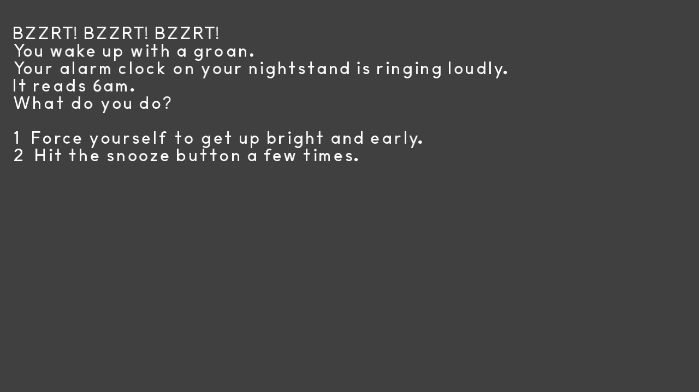

# A Day at the Gym

Author: Tyler Thompson, Pavan Paravasthu

Design: Take the role of a pro wrestler as he makes his daily visits to the gym. This is a short dating sim where you can date other pro wrestlers.

Text Drawing: Text for the game is taken from a JSON file that is then processed using nlohmann's JSON library, and rendered using harfbuzz + freetype libraries.

Screen Shot:

How To Play:

Press the corresponding number key on the keyboard to select the choice

Sources: Fonts
American Desktop.ttf : https://www.1001freefonts.com/american-desktop.font
(Unused) SansitaSwashed : https://fonts.google.com/specimen/Sansita+Swashed?subset=latin#standard-styles

This game was built with [NEST](NEST.md).

